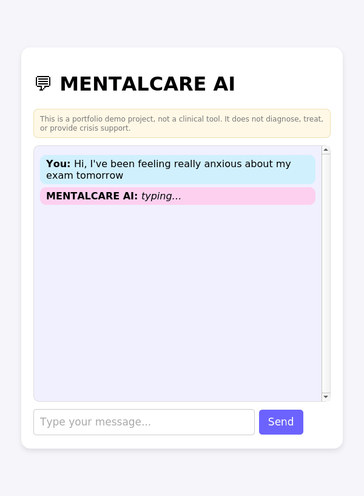
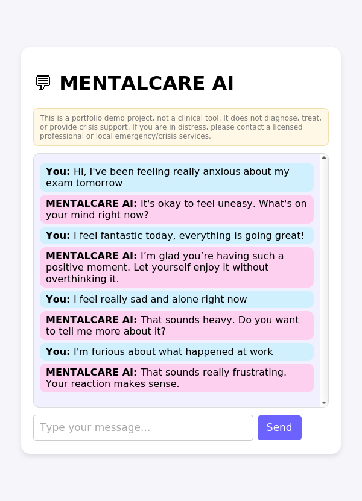
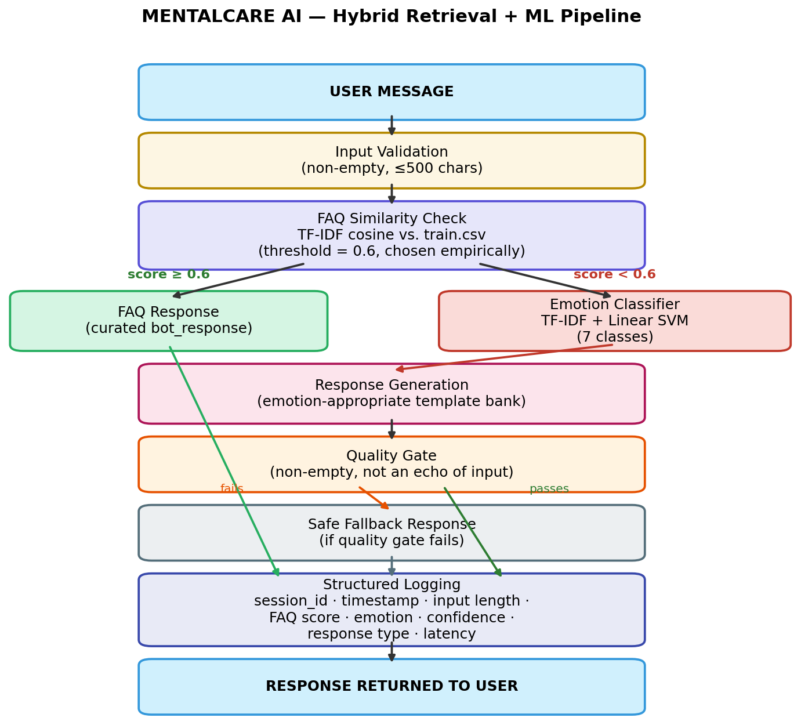

# 💬 MENTALCARE AI

**A hybrid FAQ-retrieval + ML emotion classifier chatbot, built and evaluated with a real, documented data science methodology.**

> ⚠️ **Portfolio demo project — not a clinical tool.** It does not diagnose,
> treat, or provide crisis support. If you are in distress, please contact a
> licensed professional or local emergency/crisis services. This disclaimer
> is shown directly in the app UI as well.

---

## See it in action

<p align="center">
  
</p>

<p align="center"><i>A real conversation, captured directly from the running pipeline — not scripted or hand-edited.</i></p>

<p align="center">
  
</p>

---

## What This Project Actually Does

MENTALCARE AI is a Flask chat application that responds to a user's message
in one of two ways:

1. **FAQ fast-path** — if the message closely matches a curated example
   (TF-IDF cosine similarity ≥ an empirically-chosen threshold), it returns
   a hand-written, reviewed response tied to that example.
2. **Classifier fallback** — otherwise, a trained emotion classifier
   (TF-IDF + Linear SVM, 7 classes: joy, sadness, anger, fear, surprise,
   disgust, neutral) predicts the message's emotion, and the app returns an
   emotion-appropriate templated response, filtered through a quality gate
   before being shown to the user.

Every request is logged (session, timestamp, similarity score, predicted
emotion, response type, latency) for the analytics pipeline described below.

**What it is *not*:** it does not use a large generative language model to
freely generate text, it does not store or use conversation history beyond
a session ID, and it is not clinically validated in any way. See
[Limitations](#limitations) below for the full, honest picture.

---

## Architecture

<p align="center">
  
</p>

**In short:** `User message → validate → FAQ similarity check → (match: curated response) / (no match: classify emotion → generate templated response → quality gate → fallback if needed) → log → return response.`

Implementation: [`flask_app/pipeline.py`](flask_app/pipeline.py)

---

## Real Results (not aspirational)

All numbers below are generated by the scripts in `notebooks/` and saved to
`evaluation/*.json` — nothing here is estimated.

### Baseline model comparison (5-fold cross-validation on training data, n=3,200)

| Model | Accuracy | Macro F1 | Weighted F1 |
|---|---|---|---|
| TF-IDF + Logistic Regression | 0.9997 ± 0.0006 | 0.9997 ± 0.0006 | 0.9997 ± 0.0006 |
| **TF-IDF + Linear SVM (selected)** | **1.0000 ± 0.0000** | **1.0000 ± 0.0000** | **1.0000 ± 0.0000** |
| TF-IDF + Multinomial Naive Bayes | 0.9991 ± 0.0019 | 0.9991 ± 0.0019 | 0.9991 ± 0.0019 |

### Final held-out evaluation (n=800, never used for model/threshold selection)

**Accuracy: 1.0000 · Macro F1: 1.0000 · Weighted F1: 1.0000**

### FAQ retrieval threshold experiment

TF-IDF cosine similarity at threshold **0.6** (chosen via a threshold
sweep, not an arbitrary default) achieves **100% match accuracy** with a
**0.88% unmatched rate** on held-out queries — substantially better than a
naive `difflib`-based approach, which caps out around 62% match rate on
the same data.

### Why these numbers are this high — read before citing them anywhere

The dataset's vocabulary is only **210 unique tokens across 4,000 rows**
(confirmed in the Phase 1 data audit), because it was LLM-generated from a
small set of sentence templates. This makes the 7 emotion classes close to
linearly separable by surface vocabulary alone, which is why even simple
baselines reach ~100% with no tuning. **This demonstrates the pipeline and
methodology are implemented and evaluated correctly — it does not, by
itself, demonstrate strong generalization to naturalistic, diverse
real-world text.** Full discussion: [`reports/error_analysis.md`](reports/error_analysis.md), [`LIMITATIONS.md`](LIMITATIONS.md).

Full report index: [`reports/`](reports/) · [`evaluation/`](evaluation/)

---

## Setup (verified working)

```bash
git clone <this-repo>
cd MENTALCARE_AI
pip install -r requirements.txt
```

Regenerate all data artifacts and reports (deterministic, seed=42):

```bash
python notebooks/01_data_analysis.py
python notebooks/02_data_split.py
python notebooks/03_baseline_models.py
python notebooks/05_model_comparison.py
python notebooks/06_error_analysis.py
python notebooks/07_class_imbalance.py
python notebooks/08_faq_experiment.py
python notebooks/09_conversation_analytics.py
```

Run the tests:

```bash
pytest tests/ -v
```

Run the app:

```bash
python flask_app/app.py
# open http://localhost:5000
```

Or with Docker:

```bash
docker build -t mentalcare-ai .
docker run -p 5000:5000 mentalcare-ai
```

---

## Testing & MLOps

- **19 automated tests** (`pytest tests/`) covering FAQ matching, emotion
  classification, Flask routes (including malformed JSON and validation
  edge cases), and data-split integrity (leakage checks, stratification).
- **CI**: GitHub Actions (`.github/workflows/tests.yml`) runs the full data
  pipeline and test suite on every push/PR.
- **Docker**: pinned dependencies, no hardcoded paths, `FLASK_DEBUG` and
  `PORT` configured via environment variables, debug disabled by default.

---

## Project Structure

```
flask_app/          Flask app, hybrid pipeline, templates, static assets
notebooks/           Phase-by-phase scripts: data audit -> split -> baselines
                     -> model comparison -> error analysis -> FAQ experiment
                     -> conversation analytics
data/                Raw dataset + reproducible train/evaluation split
evaluation/          JSON results for every experiment (real, not fabricated)
reports/             Markdown reports + plots for every phase
artifacts/           Versioned model file, metrics, plots, reports
tests/               pytest suite (19 tests)
docs/                Screenshot, GIF, architecture diagram (this README's assets)
```

---

## Limitations

- **Small, synthetic dataset** (4,000 rows, LLM-generated) with only 210
  unique vocabulary tokens — see [`reports/data_quality_report.md`](reports/data_quality_report.md).
- **English-only.**
- **Not a clinical tool** — no diagnosis, no treatment recommendation, no
  crisis-intervention functionality.
- **Near-ceiling accuracy is a dataset artifact**, not evidence of strong
  real-world generalization — see [Real Results](#real-results-not-aspirational) above.
- **Transformer fine-tuning (planned Phase 4) has not been run** in this
  repository — the environment used to build it has no access to
  `huggingface.co`. The complete script is provided at
  [`notebooks/04_transformer_training.py`](notebooks/04_transformer_training.py)
  for anyone to run locally.
- **Conversation analytics run on simulated demo traffic**, not real users,
  since this app has not been deployed publicly.

Full list: [`LIMITATIONS.md`](LIMITATIONS.md).

---

## License

MIT — see [`LICENSE`](LICENSE).
