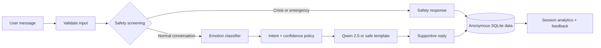

# MentalCare AI

<p align="center">
  <strong>A safety-first, emotion-aware wellness chatbot built with Flask, NLP, and local Qwen generation.</strong>
</p>

<p align="center">
  <a href="#quick-start">Quick start</a> ·
  <a href="#how-it-works">How it works</a> ·
  <a href="#qwen-powered-responses">Qwen</a> ·
  <a href="#deployment">Deployment</a> ·
  <a href="#safety-and-limitations">Safety</a>
</p>

> **Important:** MentalCare AI is a portfolio and wellness-conversation demo. It is not therapy, a medical device, a diagnostic tool, or an emergency service. If someone is in immediate danger, contact local emergency services. In the U.S. and Canada, call or text **988**.


## The problem

Many conversational AI demos can sound empathetic, but they often miss three essential product requirements:

- They treat emotional language as ordinary text instead of adapting their response.
- They can produce unsafe, diagnostic, or inappropriate advice when users express distress.
- They provide little transparency about model confidence, privacy, quality, or real-world limitations.

## The solution

MentalCare AI is a deliberately bounded chatbot that combines **emotion classification**, **risk routing**, **safe response policies**, and optional **local Qwen generation**.

It detects the emotional signal in a message, checks for potential harm before generation, builds a constrained support prompt for ordinary conversations, and records only anonymous product-quality signals. High-risk messages never reach the language model.

| What it does | Why it matters |
|---|---|
| Detects one of seven emotion labels | Adapts tone without claiming to diagnose the user |
| Routes self-harm and emergency language first | Keeps crisis content out of normal generation |
| Uses a local Qwen model optionally | Enables private, API-key-free text generation |
| Falls back to vetted response templates | Keeps the experience usable when Qwen is unavailable |
| Tracks anonymous feedback and session metrics | Supports product iteration without user profiles |

## Key features

- **Safety-first request handling** with dedicated normal, distress, possible-self-harm, and emergency paths.
- **Emotion-aware NLP** using the included TF-IDF + Linear SVM artifact.
- **Local Qwen 2.5 3B responses** through Ollama, with response validation and safe fallback behavior.
- **Session memory and analytics** for mood trends, confidence, response types, and feedback.
- **Privacy-aware SQLite persistence** using opaque session IDs, parameterized queries, and a session deletion endpoint.
- **Production foundations** including Docker Compose, GitHub Actions, linting, tests, configuration, and health checks.

## How it works



<p align="center">
  
</p>

### Response policy

1. The application validates the message length and format.
2. A safety service evaluates risk **before** emotion inference or Qwen generation.
3. For normal messages, the classifier estimates emotion and a margin-derived confidence score.
4. The app selects practical support, low-confidence clarification, local Qwen generation, or a deterministic fallback.
5. A validator rejects empty, repetitive, diagnostic, prompt-leaking, unsafe, or unreasonably long Qwen output.
6. The message metadata and optional feedback are stored under an opaque session ID.

## Qwen-powered responses

The project uses **Ollama** to run a local `my-qwen-chatbot` model built from `qwen2.5:3b`. Qwen receives a bounded recent conversation, the detected emotion, confidence, intent, and safety state.

The application does not rely on a paid LLM API. If Ollama is offline or output fails validation, it returns a safe built-in response instead.

```powershell
# Install Ollama first, then create the chatbot model from this repository.
ollama pull qwen2.5:3b
ollama create my-qwen-chatbot -f deploy\ollama\Modelfile

# Confirm that Ollama can see it.
ollama list
```

Set the following values in `.env` to enable Qwen locally:

```env
LLM_PROVIDER=ollama
OLLAMA_MODEL=my-qwen-chatbot
OLLAMA_BASE_URL=http://localhost:11434
OLLAMA_TIMEOUT_SECONDS=120
```

## Technology stack

| Area | Tools |
|---|---|
| Web application | Flask, Jinja templates, HTML/CSS |
| Emotion NLP | scikit-learn, TF-IDF, Linear SVM, joblib |
| Local generation | Ollama, Qwen 2.5 3B |
| Data and analytics | SQLite, pandas, NumPy |
| Quality | pytest, Ruff, GitHub Actions |
| Deployment | Docker, Docker Compose, Gunicorn |

## Quick start

### Prerequisites

- Python 3.11+
- Ollama (only required for Qwen-generated replies)

### Run locally

```powershell
git clone https://github.com/suvampriyaranjansahoo/Mentalcare_AI_Chatbot.git
cd Mentalcare_AI_Chatbot

python -m venv .venv
.\.venv\Scripts\python.exe -m pip install -r requirements.txt

Copy-Item .env.example .env
.\.venv\Scripts\python.exe flask_app\app.py
```

Open [http://localhost:5000](http://localhost:5000).

To use the Streamlit interface instead:

```powershell
.\.venv\Scripts\python.exe -m streamlit run streamlit_app.py
```

Open [http://localhost:8501](http://localhost:8501).

## API

| Endpoint | Description |
|---|---|
| `GET /health` | Liveness check |
| `GET /model-info` | Model labels, version, and confidence caveat |
| `POST /chat` or `POST /predict` | Emotion-aware, safety-routed response |
| `GET /sessions/<session_id>` | Messages and anonymous session analytics |
| `POST /feedback` | Record helpful / not-helpful feedback |
| `DELETE /sessions/<session_id>` | Delete a session's stored messages |

Example request:

```bash
curl -X POST http://localhost:5000/chat \
  -H "Content-Type: application/json" \
  -d '{"message":"I feel overwhelmed about tomorrow."}'
```

Example response fields include `emotion`, `confidence`, `intent`, `risk_level`, `response_type`, `model_version`, and latency.

## Data and evaluation

The included dataset contains 4,000 synthetic English messages across seven labels. The project validates input data, groups near-duplicates before splitting, compares baselines, and records reproducible evaluation artifacts.

| Model | Held-out accuracy | Status |
|---|---:|---|
| TF-IDF + Logistic Regression | 0.9997 CV | Evaluated |
| TF-IDF + Linear SVM | 1.0000 | Selected serving artifact |
| TF-IDF + Naive Bayes | 0.9991 CV | Evaluated |
| Transformer classifier | — | Not evaluated in this repository |

These metrics come from a narrow synthetic dataset and are **not** evidence of clinical effectiveness or real-world generalization. See [LIMITATIONS.md](LIMITATIONS.md) and [reports/error_analysis.md](reports/error_analysis.md).

## Deployment

### Docker deployment with Qwen

Use a Docker-capable server with at least 8 GB RAM and approximately 20 GB of free disk space.

```bash
git clone https://github.com/suvampriyaranjansahoo/Mentalcare_AI_Chatbot.git
cd Mentalcare_AI_Chatbot
cp .env.example .env
```

Set a strong `FLASK_SECRET_KEY` in `.env`, then start both the Flask app and the internal Ollama service:

```bash
docker compose up --build -d
docker compose ps
docker compose logs -f
```

The first launch downloads `qwen2.5:3b`, creates `my-qwen-chatbot`, then starts the web app on port `5000`. Keep Ollama internal; expose only the Flask service through a reverse proxy or hosting firewall.

### Streamlit Community Cloud

Streamlit Community Cloud can host the Streamlit interface but cannot run your local Ollama/Qwen model. It will use the built-in safe template responses instead. SQLite storage is temporary there, so it is appropriate only for a portfolio demo.

## Quality checks

```bash
ruff check app flask_app tests scripts
pytest tests/ -v
docker compose up --build
```

GitHub Actions installs dependencies, regenerates required model artifacts, runs the checks, and verifies the Docker image builds.

## Safety and limitations

- This project does not diagnose, treat, or replace professional care.
- It is not a crisis intervention service and should not be used as one.
- High-risk language uses a dedicated safety response and bypasses Qwen.
- Model confidence is a margin-derived uncertainty heuristic, **not** a calibrated probability.
- The training examples are synthetic and contain limited linguistic diversity.
- A production launch needs data governance review, rate limiting, observability, authentication, a managed database, and region-aware crisis resources.

See [LIMITATIONS.md](LIMITATIONS.md) and [reports/IMPLEMENTATION_STATUS.md](reports/IMPLEMENTATION_STATUS.md) for full details.

## Project structure

```text
app/                 Core API, safety, NLP, LLM, database, and analytics services
flask_app/           Flask entry point and browser UI
artifacts/           Serving model and evaluation outputs
data/                Synthetic dataset and local SQLite location
deploy/ollama/       Version-controlled Ollama model definition
tests/               Safety, API, NLP, fallback, and data-pipeline tests
```

## License

This project is available under the [MIT License](LICENSE).
