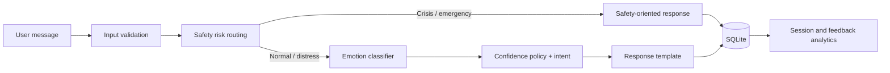

# MentalCare AI — Safety-First NLP Portfolio Project

> **Wellness conversation demo, not a therapist, medical device, diagnosis, or crisis service.** For immediate danger, contact local emergency services. In the U.S./Canada, call or text 988.

## Project overview

MentalCare AI is a Flask-based emotion-aware conversation demo designed to show a complete data-science workflow: data validation, leakage-aware splitting, baseline comparison, error analysis, model serving, safety routing, session analytics, feedback collection, and deployment automation. It preserves the original TF-IDF + Linear SVM model while replacing the monolithic request path with testable application services.

## Product objective

Provide a bounded, non-clinical conversational interface that acknowledges a user's expressed emotion, declines to diagnose, escalates high-risk language to a safety response, and produces anonymized product-quality signals without requiring profile data.

## Local Hugging Face + Ollama generation

The default repository artifact remains a lightweight TF-IDF classifier so the app starts offline. For transformer inference, install `pip install -r requirements-local-llm.txt` and instantiate `HuggingFaceEmotionClassifier` with a locally downloaded compatible emotion model. Hugging Face supplies emotion classification; Ollama supplies only local, dynamic text generation—no paid API is used.

Install Ollama, verify the already-installed custom model, and configure the app:

```powershell
ollama list
# Expected model: my-qwen-chatbot
$env:LLM_PROVIDER = "ollama"
$env:OLLAMA_MODEL = "my-qwen-chatbot"
$env:OLLAMA_BASE_URL = "http://localhost:11434"
$env:OLLAMA_TIMEOUT_SECONDS = "60"
$env:MEMORY_MESSAGE_LIMIT = "6"
```

For each normal message, the prompt contains the bounded recent session history, emotion/intent and their confidence, and safety state. High-risk messages never go to Ollama. Generated text is checked for empty output, unsafe/diagnostic language, prompt leakage, repetition, and unreasonable length; one retry is allowed, then the existing safe response fallback is used.

## Architecture



`app/` holds API, safety, NLP, service, analytics, database, and configuration concerns. The legacy `flask_app/` folder remains the runnable entry point and UI shell.

## Data and NLP pipeline

```mermaid
flowchart LR
  Raw[data/expanded_data.csv] --> Validate[scripts/validate_data.py]
  Validate --> Grouped[Normalize + group near duplicates]
  Grouped --> Split[Stratified train / held-out evaluation split]
  Split --> Baselines[TF-IDF: LR / Linear SVM / Naive Bayes]
  Baselines --> Evaluation[Metrics, confusion matrix, error report]
  Evaluation --> Registry[Model artifact and registry]
  Registry --> API[Inference API]
```



The dataset has 4,000 synthetic English examples, balanced across seven labels. Audit findings include 149 duplicate user inputs and only 210 unique tokens. Grouping normalized duplicates prevents direct train/test contamination, but the narrow template vocabulary makes its near-perfect metrics non-generalizable.

## Model evaluation

Existing, reproducible artifacts report the following held-out test result for the selected classical model:

| Model | Accuracy | Macro F1 | Weighted F1 | Status |
|---|---:|---:|---:|---|
| TF-IDF + Logistic Regression | 0.9997 CV | 0.9997 CV | 0.9997 CV | evaluated |
| TF-IDF + Linear SVM | 1.0000 | 1.0000 | 1.0000 | selected artifact |
| TF-IDF + Naive Bayes | 0.9991 CV | 0.9991 CV | 0.9991 CV | evaluated |
| Hugging Face transformer | — | — | — | not evaluated in this repository |

These values are **not evidence of clinical effectiveness or robust real-world generalization**. See [reports/error_analysis.md](reports/error_analysis.md) and [LIMITATIONS.md](LIMITATIONS.md). The transformer training script exists but no transformer metric is claimed.

## Implemented API

| Endpoint | Purpose |
|---|---|
| `GET /health` | service liveness |
| `GET /model-info` | labels, version, confidence caveat |
| `POST /chat` / `POST /predict` | safe emotion-aware response |
| `GET /sessions/<session_id>` | messages plus mood/confidence/transitions |
| `POST /feedback` | anonymized helpful/not-helpful feedback |
| `DELETE /sessions/<session_id>` | user-scoped retention/deletion action |

`POST /chat` accepts `{ "message": "...", "session_id": "optional" }`. Responses include `emotion`, `confidence`, `intent`, `risk_level`, `response_type`, latency, and `model_version`. SVM confidence is explicitly a margin-derived uncertainty heuristic, not a calibrated probability.

## Safety and privacy

- Dedicated pre-response rules distinguish normal conversation, emotional distress, possible self-harm, and emergency-high-risk language.
- Crisis/emergency messages bypass normal response generation and use a clear, non-diagnostic support response.
- SQLite stores opaque session IDs, messages, response metadata, and optional feedback—no account/profile fields.
- Queries are parameterized; HTML messages are inserted as text; secure cookie settings and basic security headers are enabled.
- Configure retention with `RETENTION_DAYS`; use the deletion endpoint for a specific opaque session.

## Product analytics

Session analytics provide dominant emotion, emotion distribution, average confidence, uncertainty rate, transition counts, conversation length, and a timestamped mood timeline. Feedback is recorded independently from message content and supports later analysis of confidence/emotion/intent versus helpfulness.

## Local development

```bash
cp .env.example .env
python -m venv .venv
.venv/Scripts/pip install -r requirements.txt   # Windows
python scripts/validate_data.py
python flask_app/app.py
```

Open `http://localhost:5000`. The application requires the existing model artifact at `artifacts/models/final_model.joblib`.

## Deploy on Streamlit Community Cloud

1. Push this repository to GitHub, including `streamlit_app.py` and `artifacts/models/final_model.joblib`.
2. In [Streamlit Community Cloud](https://share.streamlit.io/), select **New app**, choose the GitHub repository and `main` branch, then set the main file to `streamlit_app.py`.
3. Add a `FLASK_SECRET_KEY` in the Streamlit **Secrets** page. Do not commit `.env`.
4. Deploy. The app has no external API requirement: Streamlit directly loads the existing model and safety services.

Streamlit Community Cloud has ephemeral local storage. Its SQLite database is suitable only for a portfolio demo; use a managed PostgreSQL database before collecting persistent user messages or feedback.

## Deploy with Qwen responses

Streamlit Community Cloud cannot run the local Qwen/Ollama model. To deploy emotion-aware Qwen responses, use a Docker-capable host with at least 8 GB RAM and run:

```bash
cp .env.example .env
# Set FLASK_SECRET_KEY in .env to a long, random value.
docker compose up --build -d
```

The first startup downloads `qwen2.5:3b` (about 1.9 GB), then creates `my-qwen-chatbot` from `deploy/ollama/Modelfile`. The Flask app uses the included classifier to detect emotion and sends the resulting emotion, confidence, intent, and safe conversation context to Qwen. Ollama is internal-only; expose only port 5000 through your host or reverse proxy.

## Testing, reproducibility, and MLOps

```bash
ruff check app flask_app tests scripts
pytest tests/ -v
docker compose up --build
```

GitHub Actions installs dependencies, regenerates existing model artifacts, runs lint/tests, and builds the Docker image. Training/inference are separated: the serving app only loads a model artifact; data validation and evaluation belong in scripts/notebooks.

## Limitations and roadmap

Implemented versus planned status is documented in [reports/IMPLEMENTATION_STATUS.md](reports/IMPLEMENTATION_STATUS.md). The priority roadmap is: evaluate against licensed naturalistic datasets; derive validation-only confidence calibration; add a vetted region-aware crisis-resource provider; then add authenticated deployment, rate limiting, observability, and data-governance review.

## Resume-ready project summary

- Built a safety-first NLP service that separates risk routing, TF-IDF emotion inference, confidence-aware response policy, and Flask API delivery.
- Designed leakage-aware data validation and grouped stratified evaluation workflows for a seven-class text classifier, with baseline comparison and transparent synthetic-data limitations.
- Implemented SQLite-backed session memory, anonymized feedback capture, and emotion/confidence/transition analytics for product-quality measurement.
- Added reproducibility and delivery foundations: model version metadata, environment configuration, contract/safety tests, linting, Docker Compose, and CI image builds.
